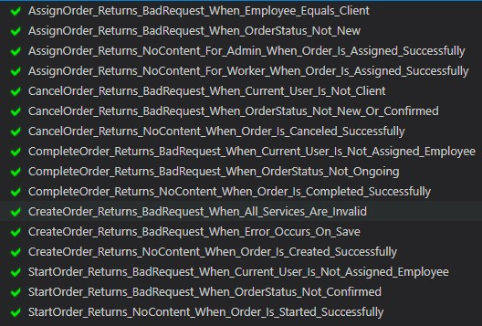
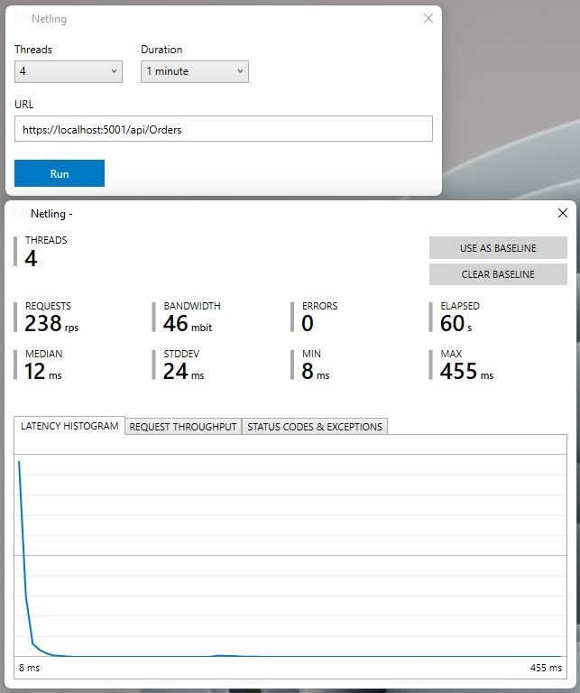

# ProjektZbiorowy

## Członkowie zespołu
* Kacper Kowalski
* Marcin Osiadacz
* Tobiasz Piwowarczyk
* Wiktor Dmitruk

## Etapy realizacji projektu
* [Etap 1 - Analiza Stanu Zastanego](./Documentation/Etap_01_FINAL.pdf)
* [Etap 2 - Analiza Systemu](./Documentation/Etap_02_FINAL_v2.pdf)
* [Etap 3 - Projekt Systemu](./Documentation/Etap_03_FINAL.pdf)

## Testy
### Testy jednostkowe API

### Testy wydajnościowe API

## Dane testowe

### Klienci:
* john_snow
* greta_green
* a_kloc
* a_golota
* client

### Pracownicy:
* areczek
* worker

### Administratorzy:
* admin

Domyślne hasło: P@ssw0rd